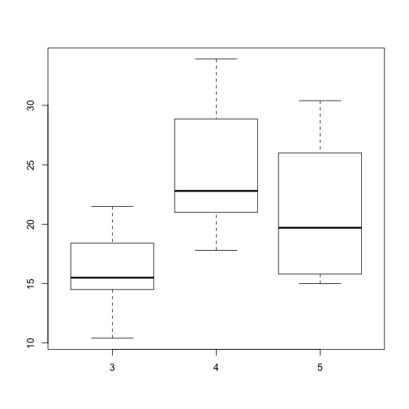

Drivers of MPG
========================================================
author: BlaBlaBla92
date: 11 June 2017
autosize: true

Overview
========================================================

This presentation was built to describe the Shiny app asked to be developed in the course project for Developing Data products in Coursera's Data Science Specialisation.

The demo of the app can be found here: https://blablabla92.shinyapps.io/shiny_app/

The code repo can be found here: XXXXXX

Functionality
========================================================
The application enables the user to select between
- Carburetors
- Transmission
- Gears
and then see the relationship between one of these and mpg.

Data set
========================================================
The data set used to produce the app is the mtcars data set. Below is a summary of the source data set.


```r
summary(mtcars[,c('mpg','gear','carb','am')])
```

```
      mpg             gear            carb             am        
 Min.   :10.40   Min.   :3.000   Min.   :1.000   Min.   :0.0000  
 1st Qu.:15.43   1st Qu.:3.000   1st Qu.:2.000   1st Qu.:0.0000  
 Median :19.20   Median :4.000   Median :2.000   Median :0.0000  
 Mean   :20.09   Mean   :3.688   Mean   :2.812   Mean   :0.4062  
 3rd Qu.:22.80   3rd Qu.:4.000   3rd Qu.:4.000   3rd Qu.:1.0000  
 Max.   :33.90   Max.   :5.000   Max.   :8.000   Max.   :1.0000  
```

Example output
========================================================
The output of the app is a box plot (+ a scatterplot)

```r
data(mtcars)
boxplot(mpg ~ gear, data = mtcars)
```


```
